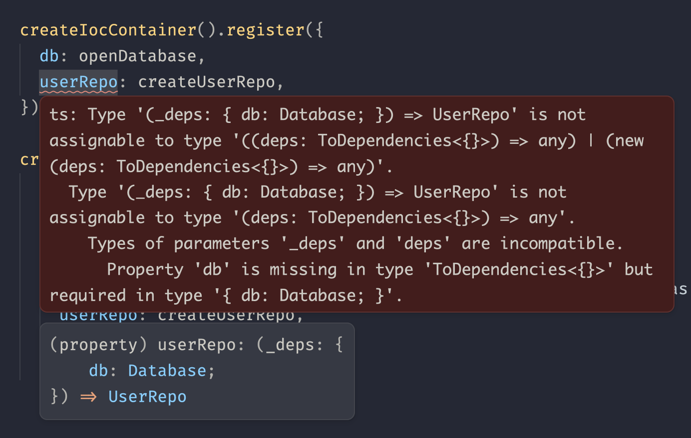

# `@aklinker1/zero-ioc`

Zero dependency, type-safe Inversion of Control (IoC) container. Designed specifically for use with singleton services, as I do on my personal projects.

## Usage

Define your services. You can use classes or factory functions:

- Class constructors can only accept a single argument, which is an object with the dependencies
- Factory functions can only accept a single argument, which is an object with the dependencies

```ts
// database.ts
export function openDatabase(): Database {
  // ...
}

// user-repo.ts
export function createUserRepo(deps: { db: Database }): UserRepo {
  // ...
}

// user-service.ts
export class UserService {
  constructor(deps: { userRepo: UserRepo; db: Database }) {
    // ...
  }
}
```

Once your services are created, you can register them on a container:

```ts
// main.ts
import { openDatabase } from "./database";
import { createUserRepo } from "./user-repo";
import { UserService } from "./user-service";

export const container = new IoCContainer()
  .register({ db: openDatabase })
  .register({ userRepo: createUserRepo })
  .register({ userService: UserService });

const userService = container.resolve("userService");
```

> [!DANGER]
> You can only call `register` with a service if you've already registered all of its dependencies. For example, if `userRepo` depends on `db`, you must register `db` in a separate call to `register` before registering `userRepo`.
>
> 
>
> Good news is TypeScript will tell you if you messed this up! If you haven't registered a dependency, you'll get a type error when you try to register the service that depends on it. Additionally, thanks to the type-safety, TypeScript will also report an error for circular dependencies!

## Paramaterization

```ts
const openDatabase = (username: string, password: string) => (): Database => {
  // ...
};

const container = createIocContainer().register({
  db: openDatabase(process.env.DB_USERNAME, process.env.DB_PASSWORD),
});
```
